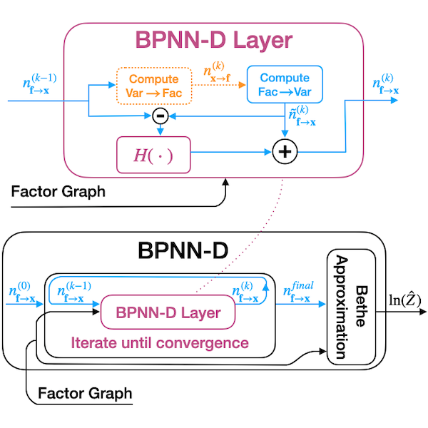

# learn_BP
This code accompanies the paper [Belief Propagation Neural Networks](https://papers.nips.cc/paper/2020/hash/07217414eb3fbe24d4e5b6cafb91ca18-Abstract.html)

This figure shows the computaion graph of an iterative BPNN-D layer run until convergence:

## Dependencies
[PyTorch](https://pytorch.org/get-started/locally/)  
[PyTorch Geometric](https://pytorch-geometric.readthedocs.io/en/latest/notes/installation.html)  
[mrftools](https://bitbucket.org/berthuang/mrftools/src/master/) (not required, can comment out imports)  
[libDAI](https://github.com/dbtsai/libDAI) used with Ising model experiments:
- junction tree algorithm for obtaining the exact partition function
- loopy belief propagation for comparison  

See environment.yml for appropriate versions.  [Instructions](https://docs.conda.io/projects/conda/en/latest/user-guide/tasks/manage-environments.html#creating-an-environment-from-an-environment-yml-file) to build a conda environment from a .yml file.  

## Training the BPNN on Ising models
Run learn_BP_spinGlass.py with mode="train"

## Training the baseline GNN on Ising models
Run learn_GNN_spinGlass.py with mode="train"

## Making figures/tables
Compiling spin glass tables into the figure in the paper
- learn_BP/data/experiments/make_figure_from_table.py (save as .eps, as shown here for high quality figures)

Run learn_BP_spinGlass.py with mode="test" 
- To make the table call create_many_ising_model_figures() 
- To make a single figure, call create_ising_model_figure()
- Set BPNN_trained_model_path and GNN_trained_model_path to the appropriate trained model paths
- create latex table with data/experiments/make_latex_table.py

Ising Model convergence plots (see commit e543da652af9ffa4ac0174c48246fbaa53ff4118/e00674bdb2962133e402dfe6a690dab81fcd20b2 on branch bpnn_d_experiments):
- set PLOT_CONVERGENCE=True in nn_models.py (and set whether BP or BPNN data is recorded)
- run learn_BP_spinGlass.py (loading a trained BPNN model, or pre-training for BP)
- run plot_convergence/make_plots.py
- get BPNN estimate improvements on converged BP models by manually entering estimates to plot_convergence/check_errors.py

SAT table/figures
- Make the SAT tables in latex form from wandb results using data/wandbCSV_to_latexTable.py
- run data/compare_BPNNvsHashing_runtimes.py (for the figuring comparing approximation of BPNN vs. F2 vs. ApproxMC and for the time ratio comparison)

Make Fig 1, aggregating BPNN/GNN/BP comparison with data/experiments/make_figure_from_table.py

## SAT data info
- data/sat_problems_noIndSets contains SAT problems stripped of sampling sets and independent sets
- data/sat_problems_IndSetsRecomputed contains SAT problems stripped of sampling sets and with independent sets recomputed with a timeout of 1000 seconds
- Dsharp/ApproxMC/F2 results obtained by running /atlas/u/jkuck/F2/fireworks/fireworks_compare_bounds.py
